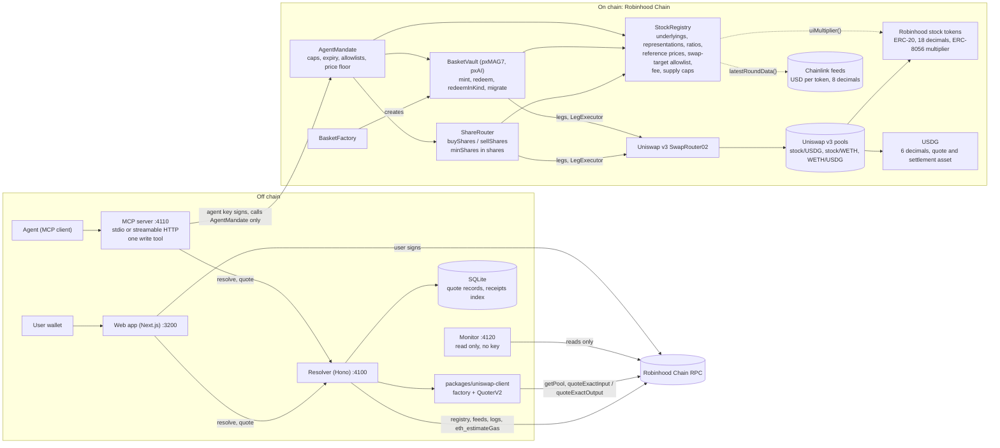

# Architecture

Parallax on Robinhood Chain (chain id 4663). The design was first built for BNB Chain; `docs/decisions.md`
records what changed in the port and why, and `docs/addresses.md` has the source and the on-chain check for
every address named here.

There is no keeper and no third-party market-data API in the execution path. The share ratio is the token's own
`uiMultiplier()`, the reference price is a Chainlink feed, and quotes come from Uniswap v3 contracts, all read
from the chain (D3, D6).

## Components

**Off chain**

- **Resolver** (`apps/resolver`, Hono, port 4100). Reads the registry, the Chainlink feeds and Uniswap v3
  (factory and QuoterV2, through `packages/uniswap-client`) over the chain's RPC. Scores routes, applies the
  caller's policy, builds legs and an unsigned transaction, simulates it, and stores the scoring record. It holds
  no signing key for user funds. `POST /faucet` exists only on the local chains and, when `FAUCET_PRIVATE_KEY`
  is set, on the testnet; it is not registered on mainnet.
- **SQLite** (`node:sqlite`, one file per chain id). Tables: `quotes` (scoring records by `quoteHash`),
  `receipts` (indexed `RouteReceipt` logs), `rebalances` (indexed `Migrated` logs), `chainlink_rounds` and
  `market_bars` (history caches), `kv` (indexer cursor).
- **MCP server** (`apps/mcp`, stdio by default, streamable HTTP at `:4110/mcp` with `--http`). Twelve tools.
  Eleven read or build unsigned transactions: `get_network`, `search_stocks`, `resolve_stock`, `list_baskets`,
  `get_basket`, `quote_basket_mint`, `quote_basket_redeem`, `get_mandate`, `build_create_mandate`,
  `get_receipts`, `explain_receipt`. One writes: `execute_with_mandate` signs with `AGENT_PRIVATE_KEY` and sends
  only to the `AgentMandate` address from the deployment file (`agentBuyShares` or `agentMintBasket`). Without a
  key the write tool refuses.
- **Web app** (`apps/web`, Next.js with wagmi and viem). Pages: stocks, buy, baskets, basket detail, portfolio,
  receipts, mandates, how it works. It asks the resolver for quotes and sends the returned transaction through
  the user's wallet. A dialog asks every visitor to confirm eligibility before any product page can be used.
- **Monitor** (`apps/monitor`). No key, no transactions. `monitor once` runs every check and exits 1 on a
  critical finding; `monitor watch` repeats every `MONITOR_INTERVAL_S` and serves the last report at
  `:4120/health` (HTTP 503 while anything is critical). Checks: feed age against the registry's `maxPriceAge`;
  live multiplier against the registry checkpoint and `maxRatioStepBps`; a multiplier change the issuer has
  scheduled; `paused()` on each token and on USDG; USDG depth in each stock's direct pools; the guardian's buy
  pause; `backingOk()` on every vault.

**On chain** (`contracts/src`, Solidity 0.8.26, OpenZeppelin 5)

- **`StockRegistry`**. Underlyings (`bytes32("NVDA")`), their representations (token, platform id, ratio
  source), the swap-target allowlist, the protocol fee (hard cap 1 %), per-vault supply caps and the reference
  price. For an ERC-8056 token `ratioOf` reads `uiMultiplier()` live. `referencePrice(underlying)` returns USD
  per share: the feed answer scaled to 1e18 and, where the feed was set with `setTokenPriceFeed`, divided by
  that token's live ratio (D2). Roles: `DEFAULT_ADMIN_ROLE`, `KEEPER_ROLE`, `GUARDIAN_ROLE`; the deploy script
  gives all three to the deployer unless `KEEPER_ADDRESS` is set.
- **`ShareRouter`**. `buyShares` and `sellShares`. Holds tokens only inside a call.
- **`BasketVault`**. An ERC-20 whose unit is a fixed number of shares of each constituent. Two are configured:
  pxMAG7 (seven stocks, equal weight) and pxAI (NVDA, MSFT, GOOGL, META at 40/20/20/20).
- **`BasketFactory`**. Creates vaults (role-gated) and lists them.
- **`AgentMandate`**. Lets an agent address spend an owner's USDG within caps, an expiry, allowlists and a
  price floor, with every output sent to the owner.
- **`LegExecutor`** (internal library, compiled into the router and the vault). One swap leg: approve the target
  for `maxIn`, call it, reset the approval to zero, measure what was spent and received by balance deltas.
- **External**: Uniswap v3 SwapRouter02 `0xCaf681a66D020601342297493863E78C959E5cb2`, the only address the
  deploy configuration puts on the allowlist; Robinhood stock tokens (ERC-20, 18 decimals, ERC-8056
  multiplier); USDG `0x5fc5360D0400a0Fd4f2af552ADD042D716F1d168` (6 decimals); Chainlink stock feeds (8
  decimals, priced per token).

## Units

| Quantity | Scale |
|---|---|
| USDG amounts: `usdgIn`, `maxUsdgIn`, `minUsdgOut`, mandate caps, fees, refunds | raw USDG, 6 decimals (1 USDG = `1e6`) |
| Stock token amounts | raw, 18 decimals |
| Ratio (`uiMultiplier()`, `ratioOf`) | shares per token, 1e18 |
| Shares, `minShares`, `sharesPerUnit`, `minShareGain`, basket units | 1e18 |
| Reference price (`StockRegistry.referencePrice`) | USD per share, 1e18 |
| Chainlink answer | USD per token, 8 decimals |

`shares = tokens × ratio / 1e18` (rounded down when crediting). `tokens = shares × 1e18 / ratio` (rounded up
when something must be held). USDG is taken at one dollar. A USDG amount meets a 1e18 USD price in exactly two
places: on chain in `AgentMandate` (`quoteScale = 10^(18 - decimals) = 1e12`), and off chain through
`usdgToWad` / `wadToUsdg` in `packages/sdk` (D1). API and MCP inputs and outputs are decimal strings.

## Request flow: "buy 500 USDG of NVDA"

1. **Identity.** The resolver reads `StockRegistry.getUnderlying`, `marketState` and `representationsOf(NVDA)`,
   and for each token `getRepresentation`, `ratioOf`, `isBuyEligible`, `isSellEligible` and `attestedAt`. On this
   chain each stock has one representation, platform id `robinhood`, ratio source `ERC8056`. It also reads the
   token's `newUIMultiplier()` and `effectiveAt()` and reports a scheduled change as `pendingMultiplier`.
2. **Reference and market state.** `StockRegistry.referencePrice(NVDA)` gives USD per share. Market state is
   computed from the feeds' 24/5 schedule (open Sunday 20:00 to Friday 20:00 New York time) and labelled
   `computed`.
3. **Quote.** `usdAmount` is parsed to raw USDG (`500` becomes `500000000`). `UniswapV3Client` asks the factory
   for the pool at each fee tier (100, 500, 3000, 10000), drops pools with no in-range liquidity and USDG pools
   holding less than 1,000 USDG, and builds the candidate routes: every single-hop tier, and every pairing of a USDG/WETH pool with a
   WETH/stock pool. QuoterV2 prices each one (`quoteExactInputSingle`, or `quoteExactInput` for two hops) and the
   route that returns the most tokens wins. `sharesOut = tokensOut × ratio / 1e18`. Cost per share is
   `(usdgIn × 1e12 + gasUsd) × 1e18 / sharesOut`; the premium against the reference is reported with gas and
   without. Slippage is measured by quoting 0.1 % of the size (at least 1 USDG) on the same route.
4. **Policy.** Premium cap (default 100 bps while the market is open, 50 bps while it is closed), slippage cap
   (default 50 bps), platform exclusions and preferences, and an optional issuer cap on the wallet's resulting
   holdings. The attestation check runs only against a registry that requires one; this deployment sets
   `maxAttestationAge` to the largest `uint64`, which turns it off (D4). Every exclusion carries a reason string.
   While the computed market is closed and the policy does not set `allowClosedMarket`, the result is
   `queued_until_open` and no transaction is built.
5. **Route.** Candidates are ranked by shares out. The split search across two representations still exists and
   only runs when a second eligible representation exists, which is not the case on this chain today (D9). The
   leg is `exactInputSingle` (one hop) or `exactInput` (two hops through WETH) on SwapRouter02 with
   `recipient = ShareRouter` and `amountOutMinimum = tokensOut × (1 - maxSlippageBps / 10000)`.
   `minShares = sharesOut × (1 - maxSlippageBps / 10000)`.
6. **Fee.** `StockRegistry.fee()` gives the fee in bps (the deploy script sets 50 unless `FEE_BPS` says
   otherwise). The fee is charged on the USDG spent, on top of it, so the transaction pulls
   `totalUsdgIn = usdgIn + usdgIn × bps / 10000`.
7. **Record.** The whole result is written as canonical JSON (sorted keys, bigints as strings);
   `quoteHash = keccak256` of it. It is stored in SQLite and served at `GET /quotes/:hash`.
8. **Simulate.** `eth_estimateGas` from the user's address. If the user has not approved USDG yet or lacks the
   balance, the simulator finds USDG's balance and allowance storage slots by probing with state overrides and
   overrides them, so the route is still checked end to end. If the simulation fails the transaction is withheld
   (`tx: null`) and the error is returned.
9. **Execute.** The user signs
   `ShareRouter.buyShares(underlyingId, usdgIn, minShares, legs, recipient, quoteHash)` with
   `usdgIn = totalUsdgIn`. An agent calls
   `AgentMandate.agentBuyShares(id, underlyingId, usdgIn, minShares, legs, quoteHash)` instead, which pulls the
   USDG from the owner, calls the router with the owner as recipient and then checks its own floor. For each leg
   the router checks that the target is allowlisted, `tokenIn` is USDG, `tokenOut` is buy-eligible and is a
   representation of the requested underlying; runs the leg through `LegExecutor`; converts the tokens received
   to shares through the registry; forwards the tokens to `recipient`; and emits `RouteReceipt`. After the legs it
   reverts with `InsufficientShares` unless `sharesOut >= minShares`, reverts with `OverSpent` if more than
   `usdgIn` left the contract, pays the fee on the amount spent out of the remainder, refunds the rest to the
   caller and emits `BuyExecuted`.
10. **Index.** The resolver polls `RouteReceipt` logs from the router and every vault, and `Migrated` logs from
    the vaults, in 2,000-block chunks. `GET /receipts` joins them with the stored record; the app's receipt view
    and the MCP tool `explain_receipt` render it.

A sell is the same flow in the other direction: `ShareRouter.sellShares(underlyingId, representation,
tokenAmount, minUsdgOut, legs, recipient, quoteHash)`, where `minUsdgOut` is net of the fee and unsold tokens
return to the caller. Selling requires only that the token is registered.

**Quote-only mode.** Where no deployment file exists for the chain (mainnet at the time of writing, see the
status table in `docs/decisions.md`), the resolver takes the universe from
`contracts/script/config/robinhood.json`, reads each token's `uiMultiplier()` and its feed directly, quotes the
real pools, and returns `executable: false` and no transaction.

## Basket flow: mint 1 pxMAG7

1. `POST /baskets/pxMAG7/quote-mint` with `units`, or with `budgetUsdg` (the most the buyer will spend; the
   units are sized so that `maxUsdgIn` stays inside it).
2. For each constituent the shares needed are `ceil(units × sharesPerUnit / 1e18)` plus a 1 bps margin. The
   mint's own legs must deliver all of it: surplus already in the vault belongs to the existing holders and is
   not counted.
3. The tokens needed are `tokensForShares(needed, ratio)`, rounded up. `bestExactOutput` prices them on every
   route (`quoteExactOutputSingle`, or `quoteExactOutput` through WETH) and takes the one that needs the least
   USDG. Where a constituent has an issuer cap below 100 % and two eligible representations, fills are allocated
   best first within the cap with a 20 bps haircut; pxMAG7 and pxAI are configured with `maxIssuerBps = 10000`,
   so that step is inactive for them.
4. Each leg is `exactOutputSingle` or `exactOutput` on SwapRouter02 with `recipient = the vault` and
   `amountInMaximum = quote + 30 bps + 1`. `maxUsdgIn` is the sum of those ceilings plus the fee on that sum.
5. `BasketVault.mint(units, maxUsdgIn, legs, recipient, quoteHash)` checks the supply cap, pulls `maxUsdgIn`,
   runs the legs (allowlisted target, `tokenIn` USDG, `tokenOut` a buy-eligible representation of a
   constituent), reverts with `OverSpent` if the legs used more than `maxUsdgIn`, mints, then checks that this
   call delivered every constituent's share of `units` (`UnderDelivered`), that backing holds for every
   constituent (`BackingViolated`) and that issuer caps hold. It pays the fee on the USDG spent out of the
   unspent remainder and refunds the rest. An agent uses `AgentMandate.agentMintBasket(id, basket, units,
   maxUsdgIn, legs, quoteHash)`.

**Redeem to USDG.** `quote-redeem` computes the pro-rata slice of every token the vault holds, quotes each with
`bestExactInput` into USDG, and builds `BasketVault.redeem(units, minUsdgOut, legs, recipient, quoteHash)`. The
vault burns first, lets each leg sell at most the redeemer's slice (`LegExceedsProRata`), pays the fee out of
the USDG received, enforces `minUsdgOut` on the net amount and hands over anything unsold in kind.

**Redeem in kind.** `BasketVault.redeemInKind(units, recipient)` burns the units and transfers the pro-rata
slice of every token and of any USDG the vault holds. No legs, no registry eligibility check, no reference
price, no fee. `redeemInKindSkipping(units, recipient, skip)` does the same and leaves out the tokens named in
`skip`, for a token its issuer has frozen.

**Migrate.** `BasketVault.migrate(underlyingId, legs, minShareGain, quoteHash)` can be called by anyone and may
only move a constituent between its own representations at a strict share gain. With one issuer per stock there
is no second representation to move into, so the resolver's `GET /migrations` returns nothing on this chain. The
path is kept and tested with two mock issuers (D9).

## Data provenance

| Field | Source | Label in the API |
|---|---|---|
| Share ratio | the token's `uiMultiplier()` on chain, read through `StockRegistry.ratioOf` | `ratioSource: "ERC8056"` |
| Scheduled ratio change | the token's `newUIMultiplier()` and `effectiveAt()` | `pendingMultiplier` |
| Reference price | the Chainlink feed through `StockRegistry.referencePrice`, USD per share | `referenceSource: "chainlink:NVDA/USD via registry"`; in quote-only mode the feed is read directly and divided by the multiplier: `"chainlink:NVDA/USD"` |
| Market status | computed from the 24/5 feed schedule; exchange holidays are not modelled | `market.source: "computed"` |
| Quotes | Uniswap v3 QuoterV2 on chain | `venue: "uniswap-v3:500"`, or `"uniswap-v3:100>500"` for two hops |
| Pool depth | token balances of the Uniswap v3 pools (`balanceOf(pool)`) | `poolUsdg`, `poolFees` |
| Token list, feeds, names and logos | Robinhood's asset list and Chainlink's feed directory, fetched and checked on chain by `scripts/gen-universe.mts`, written to `contracts/script/config/robinhood.json` | `/health` `universe` |
| NAV per unit | `Σ sharesPerUnit × referencePrice`; display only, never used by a contract | `navSource` |
| Return figures and price history | Chainlink rounds (`getRoundData`) where the stock has a feed; otherwise daily closes from a public chart endpoint (`MARKET_HISTORY_URL`), otherwise a Uniswap pool's TWAP. Display only. | `source` on the series, `coverageBps` on index returns |
| Gas cost in USD | block base fee × a gas estimate × ETH price quoted from the WETH/USDG pool | `gasUsd` |
| Network | resolver configuration and deployment file | `/health` `label`: `name`, `kind`, `chainId`, `explorer`, `mocked` |

What is mocked, and how it is labelled:

| Network | Mocked | Label |
|---|---|---|
| Robinhood Chain (4663) | nothing | `label.mocked: []`, `dataSource: "live"` |
| Local fork (31337, `pnpm fork:up`) | nothing; real tokens, USDG, pools and feeds at the forked block | `label.kind: "local"`, `label.mocked: []` |
| Local mocks (1337, `pnpm mocks:up`) | `MockStockToken`, `MockUSDG` (6 decimals), `MockSwapTarget`, and reference prices posted once from the mainnet Chainlink answers recorded in `mocks.json` | `label.mocked: ["stock tokens", "USDG", "swap venue", "reference prices"]`, `dataSource: "fixture"`, `referenceSource: "registry reference price"`, `market.source: "registry"`, `venue: "mock"` |
| Robinhood Chain Testnet (46630) | the same mock contracts (D7). Quotes are priced against the registry's posted snapshot, the same prices the mock venue trades at; only the price history is read from mainnet's Chainlink rounds, named as mainnet's and display only. `HYBRID_MARKETS=1` switches reference prices and pool depth to mainnet's as well | `label.mocked: ["stock tokens", "USDG", "swap venue", "reference prices"]`; with `HYBRID_MARKETS=1` the last entry is dropped and `/health` `hybrid` names both sides |

The MCP tool `get_network` returns the same label, and the app shows it on every screen. The universe file is
never edited by hand: `gen-universe.mts` stops on any mismatch between the published lists and the chain.

## Ports

| Service | Port |
|---|---|
| Resolver | 4100 |
| MCP server (HTTP transport) | 4110 |
| Monitor (`/health`) | 4120 |
| Web app | 3200 |
| Fork anvil | 8647 |
| Mocks anvil | 8648 |

## Packages

| Path | Role |
|---|---|
| `contracts/` | Foundry: `StockRegistry`, `ShareRouter`, `BasketVault`, `BasketFactory`, `AgentMandate`, `ShareMath`, `LegExecutor`, `ReceiptEmitter`, mocks, tests (unit, fuzz, invariant, fork, Medusa/Echidna harness), deploy scripts, `script/config/robinhood.json` and `mocks.json` |
| `packages/sdk` | ABIs generated from the forge artifacts, chain definitions and addresses, ids, the share math mirror (parity-tested against forge vectors), USDG conversions, leg encoding for SwapRouter02, receipt decoding, deployment loader |
| `packages/uniswap-client` | Uniswap v3 read client: pools from the factory, quotes from QuoterV2, single-hop and two-hop routes, depth |
| `apps/resolver` | identity, scoring, policy, basket quoting, simulation, quote store, receipts indexer, HTTP API |
| `apps/mcp` | MCP server (stdio and streamable HTTP), twelve tools, writes only through `AgentMandate` |
| `apps/monitor` | read-only health checks, CLI and `/health` |
| `apps/web` | Next.js app: stocks, buy, baskets, portfolio, receipts, mandates |
| `scripts/` | `gen-universe.mts`, `fork-up.sh` (mainnet fork on :8647), `mocks-up.sh` (mocks chain on :8648), `testnet-up.sh` |
